---

 

`Full-Stack`

 

## projects

**[Drape-Soul](https://github.com/n0eel/drape-soul-archive)** — A modern e-commerce web interface for a premium clothing/textile brand with a focus on minimalist design, high performance, and a smooth user experience (UX).
Key features: interactive product catalog with dynamic filtering and sorting, a stateful shopping cart (session state), a responsive high-definition image gallery, and smooth interface animation.
`next.js` `supabase` `tailwind` `vercel`

**[Live Puzzle](https://github.com/n0eel/live-puzzle)** — An innovative web app/game (puzzle) that uses a webcam and machine learning algorithms for touchless interface control using hand gestures.
Features: real-time gesture recognition (element grabbing, saving), canvas rendering for dividing images into puzzle pieces, game logic (timer, scoring, results gallery), and performance optimization for high FPS.
`Canvas 2D API` `MediaPipe Hands` `getUserMedia` `HTML5` `Vanilla JS` `CSS`

 

## stack

**frontend** — vue, next.js, react, tailwind, vite, html/css

**backend** — nestjs, node.js, python, supabase

**mobile** — flutter

**languages** — typescript, javascript, python, bash

**tools** — docker, git, vercel

 

---

 

